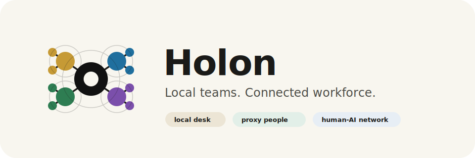

  

# Holon

**Your AI team. Connected to everyone else's.**

Holon gives every person a small, private team of AI workers — and lets those teams work with the AI teams and real people of everyone you trust. The first hybrid workforce that actually scales beyond a single chat window.

Live site: **https://chenz16.github.io/Holon/**

## Why Holon

Today you get one of two bad deals: a single chat assistant that forgets the rest of your team exists, or an "agent platform" that asks you to be a robot manager. Real work doesn't live in either.

Real work lives between people, the AI workers behind those people, and the handoffs that connect them. Holon is built for that.

## Inspired by nature

The strongest intelligence in nature is never centralized. It's a network of small wholes, connected by clean handoffs — mycelium under a forest, neurons in a cortex, ants in a colony. Same pattern, every scale.

We didn't invent this idea. We named the product after it.

> **holon** *(n.)* — coined by Arthur Koestler, 1967. From Greek *hólos* "whole" + suffix *-on* "part." A unit that is simultaneously a complete whole *and* a node in a larger whole.

Every Holon desk is a complete team. Every team is a node in a larger network.

## Status

Currently in design phase. This repo holds the public marketing site. The full product and architecture design lives in a separate (private) engineering repo.

## Contact

Early-access requests: chen.zhang6@gmail.com
