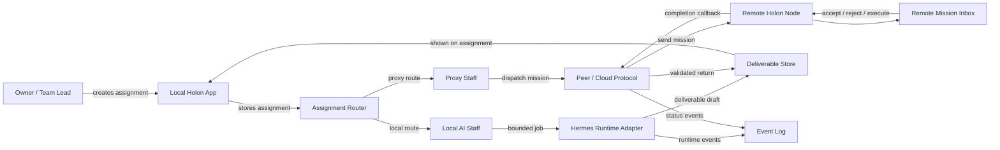
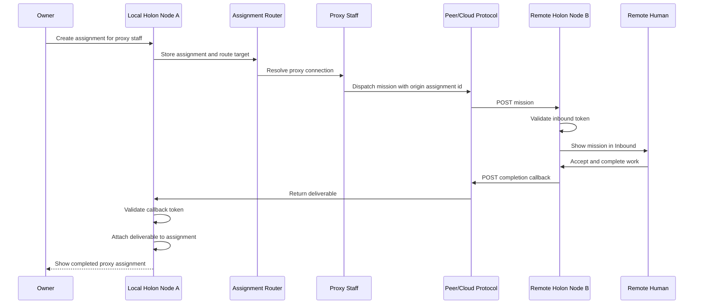
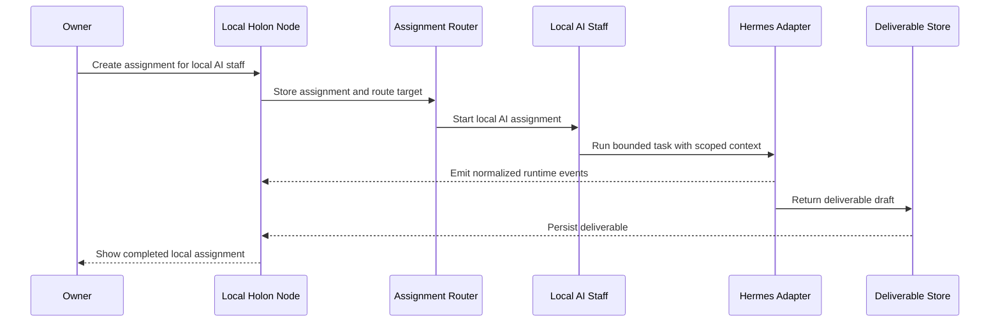

# Functional Architecture

Status: draft
Date: 2026-05-15

## Purpose

This document defines Holon's abstract product architecture: what the system is, what entities it owns, how data moves, and how work flows across local teams and remote people.

It intentionally avoids implementation choices. See `implementation-architecture.md` for concrete stack and layer decisions.

## Core Product Shape

Holon is a network of local teams.

Each local app is a **node**. Each node can build and manage its own lightweight team. A node can also connect to other nodes through proxy staff.

```text
Holon Network
  -> Node A: local team owned by Alice
  -> Node B: local team owned by Bob
  -> Node C: hosted team owned by a company desk
```

Each node is both:

- a complete local work unit
- a participant in a larger hybrid workforce network

## Main Concepts

### Node

A node is the local accountability boundary.

It owns:

- owner identity
- local team roster
- inbound missions
- outbound assignments
- connection credentials
- policy and budgets
- deliverables
- local event history
- runtime adapter configuration

### Local Team

A local team is the shallow team inside one node.

```text
Owner
  -> local AI staff
  -> proxy staff
  -> temporary helpers under assignments
```

The team can be useful by itself. It should not require cloud networking to run local AI tasks.

### Local AI Staff

Local AI staff execute inside the node through a runtime adapter. They can use scoped tools, context, memory, and assignment workspaces.

They do not create permanent staff or change node permissions without owner approval.

### Proxy Staff

Proxy staff are local staff identities that route work to a remote human-owned node.

Proxy staff make remote people feel operationally present in the local team without exposing the remote node's internal staff, tools, or data.

### Mission

A mission is inbound work from another node.

The receiving owner can:

- accept
- reject
- ask a question
- complete manually
- delegate to local AI staff
- forward to proxy staff
- submit a deliverable

### Assignment

An assignment is local work initiated by the owner, system, schedule, or accepted mission.

Assignments can target:

- local AI staff
- proxy staff
- the owner
- future automation runners

### Deliverable

A deliverable is durable output attached to the assignment or mission that produced it.

It should be treated as a work artifact, not a transient chat message.

### Connection

A connection grants one node permission to send work to another node.

Minimum properties:

- source node
- target node
- inbound token or relay credential
- target label
- permissions
- rate/budget limits
- status
- last seen
- revoked state

### Handoff

A handoff is the accountable transfer of work from one owner boundary to another.

It is the core functional primitive behind proxy work. Assignments and missions describe local work objects; handoffs describe the cross-boundary responsibility transfer.

Examples:

```text
Owner -> local AI staff
Owner -> proxy staff -> remote human
Remote human -> their local AI staff
Remote human -> another proxy staff
```

A handoff must preserve:

- sender
- receiver
- requested outcome
- context package
- authority granted
- budget or limit
- expected return artifact
- current state
- audit trail

See [`handoff-design.md`](handoff-design.md) for the detailed handoff model.

## Data Flow

### Functional Flow Diagram

GitHub renders this Mermaid diagram directly in Markdown.



### Proxy Assignment Sequence



### Local AI Assignment Sequence



For a standalone rendered version, open [`diagrams.html`](diagrams.html).

### Local AI Assignment

```text
Owner creates assignment
  -> node stores assignment
  -> router sees target = local AI staff
  -> runtime adapter receives scoped assignment
  -> runtime emits events
  -> node stores events
  -> runtime returns deliverable
  -> node stores deliverable
  -> assignment becomes completed
```

Key rule: runtime output is normalized before it reaches the product UI.

### Proxy Assignment

```text
Owner creates assignment
  -> node stores assignment
  -> router sees target = proxy staff
  -> node creates handoff record
  -> connection layer validates target
  -> mission is sent to remote node
  -> local assignment becomes waiting_remote
  -> remote node receives mission
  -> remote owner acts on mission
  -> remote node returns deliverable
  -> origin node validates callback
  -> origin node stores deliverable
  -> local assignment becomes completed
```

Key rule: the origin node does not need to know how the remote node completed the work.

### Inbound Mission

```text
Remote node sends mission
  -> local node validates token/relay credential
  -> local node creates mission
  -> owner sees mission in Inbound
  -> owner accepts or rejects
  -> accepted mission can create local assignment
  -> deliverable is submitted upstream
```

Key rule: inbound work enters the local owner's decision queue first. Remote nodes cannot directly command local staff.

### Multi-Hop Work

Holon supports recursive network shape without forcing deep local hierarchy.

```text
A -> proxy staff for B
B -> local AI staff, or proxy staff for C
C -> completes work
C -> returns to B
B -> returns to A
```

Each hop is independently accountable. Every node sees its own inbound and outbound state.

## Workflow States

### Assignment States

```text
draft
queued
running_local
waiting_remote
retrying
blocked
completed
cancelled
failed
```

### Mission States

```text
queued
accepted
in_progress
blocked
submitted
rejected
expired
returned_to_origin
```

### Connection States

```text
unconfigured
healthy
degraded
offline
retrying
revoked
invalid_token
```

## Event Model

Every important action should produce an event.

Event types:

- assignment_created
- assignment_routed
- local_runtime_started
- runtime_event
- deliverable_created
- proxy_dispatch_requested
- proxy_dispatch_sent
- proxy_dispatch_failed
- mission_received
- mission_accepted
- mission_rejected
- mission_submitted
- callback_received
- connection_pinged
- connection_failed
- token_rotated
- permission_denied

Events support:

- UI timeline
- debugging
- audit
- retry logic
- future analytics

## Permissions

Holon should use explicit boundaries.

Owner can:

- create local staff
- create proxy staff
- configure connections
- approve/reject inbound missions
- submit deliverables
- revoke connections
- set local policies

Local AI staff can:

- execute assigned work
- request tools within assignment scope
- propose deliverables
- propose memory/skill updates

Local AI staff cannot:

- create permanent staff
- change connection credentials
- command remote people
- bypass owner approval for high-risk actions

Proxy staff can:

- receive local assignments
- route work to remote node
- return status and deliverables

Proxy staff cannot:

- expose remote node internals by default
- directly operate local runtime
- change local policy

## System Boundaries

### Local Node Boundary

The local node owns:

- local database
- local team
- local tools/context
- owner workflow
- local runtime adapters

### Cloud Boundary

The cloud service owns:

- identity
- optional hosted nodes
- connection registry
- relay
- retries
- policy distribution
- audit aggregation

### Runtime Boundary

The runtime owns:

- model calls
- tool execution
- temporary helper execution
- scoped assignment memory
- generated deliverable draft

The runtime is not the product authority.

## Product Invariants

1. Every local app can form a useful small team.
2. Local team depth remains shallow.
3. Cross-team complexity comes from node-to-node handoffs.
4. Every mission has a human accountability boundary.
5. Every returned work item becomes a deliverable.
6. Silent network failure is not acceptable.
7. Proxy staff must be visibly different from local AI staff.
